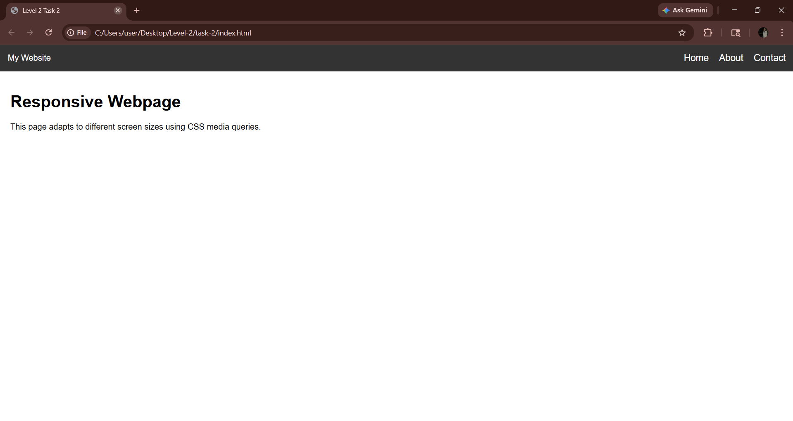

# 📱 Cognifyz Web Development Internship - Level 2 Task 2

## 📌 Project Overview

This project is part of the **Cognifyz Web Development Internship Program**.
In this task, I implemented a **responsive webpage** using CSS media queries and created a **mobile-friendly navigation menu (hamburger menu)**.

---

## 🎯 Task Objective

The objective of this task is to:

* Convert a basic webpage into a **responsive design**
* Use **CSS media queries** to adapt layout for different screen sizes
* Create a **hamburger menu** for mobile devices

---

## 🛠️ Technologies Used

* HTML5
* CSS3
* JavaScript

---

## ✨ Features

✔ Fully responsive webpage
✔ Mobile-friendly navigation menu
✔ Hamburger menu for small screens
✔ Smooth toggle functionality using JavaScript
✔ Clean and simple UI

---

## 📸 Output Preview



---

## 🚀 How to Run the Project

1. Download or clone this repository
2. Open the project folder
3. Double-click on `index.html`
4. Resize the browser to test responsiveness

---

## 📁 Project Structure

```plaintext
level2-task2/
│── index.html
│── Result3.png
│── README.md
```

---

## 🔄 Functionality Explanation

### 🔹 Responsive Design

Used CSS media queries:

```css
@media (max-width: 768px)
```

to adjust layout for smaller screens.

### 🔹 Hamburger Menu

* Appears only on mobile screens
* Clicking toggles menu visibility
* Implemented using JavaScript

---

## 📢 Acknowledgment

Thanks to **Cognifyz Technologies** for providing this opportunity to learn responsive design and modern web development techniques.

---

## 🔗 LinkedIn Post

https://www.linkedin.com/posts/pawan-pushkar-8b32a73b4_cognifyz-cognifyztech-cognifyztechnologies-ugcPost-7445218538413522944-2QEo?utm_source=share&utm_medium=member_desktop&rcm=ACoAAGUidkcBuEso8AO2qTufjuY5zv3MjncyKf0


---

## 🏷️ Hashtags

#cognifyz #cognifyzTech #cognifyzTechnologies #responsive #webdevelopment #internship #frontend

---
